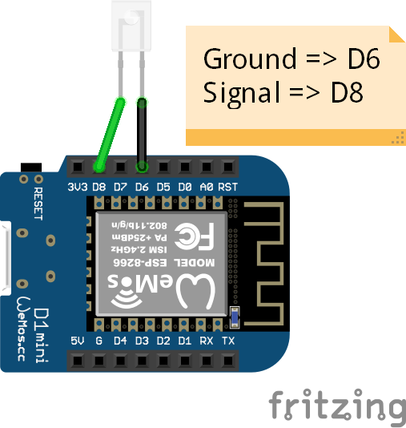

# Infrared Device Control

>By TORGUE Guilhem, PEAN Michaël and LANGLOIS Pierre-Henry

## Description

The objective of this project was to create a **IoT device** acting on one hand as a **http server able to receive http requests**
and on the other hand as a **Infrared emittor to switch on and off differents appliances**.

This project also contains a simple Node.js web interface example, calling the IoT device's APIs.

## How does it work ?

### Schema / Wiring



### Explanation

On this project the wiring remains very simple, the LED is connected on the Wemos device following the scheme.

The Wemos is connected to a LAN via WIFI and host a web server receiving the http calls.

Following the request received, the Wemos will call the appropriate callback function to use the IR LED.

The IR LED will then send the appropriate IR signal.


### Hardware

| Reference |                Product                |  Qty  |               Price |
| --------- | :-----------------------------------: | :---: | ------------------: |
| ESP8266   | WEMOS D1 Mini ESP8266 Microcontroller |   1   |               2,99€ |
| VMA316    |      Infrared Transmitter Module      |   1   | 4,94€ (bundle of 2) |

### Code

The code to send to the Wemos is contained in the **InfraredManager** repertory.

Our code is based on the [Hello Server Example for ESP8266](https://github.com/esp8266/Arduino/blob/master/libraries/ESP8266WebServer/examples/HelloServer/HelloServer.ino).

The logic is quite simillar, routes are defined and each of them uses a handler.

### Final Result


## Setup step by step

1. Set the `Complementary board URL` in the Arduino IDE settings: `http://arduino.esp8266.com/stable/package_esp8266com_index.json`

2. In the `Tools` menu :
    Go to`Board Type -> Board Manager` and install the following packages: `esp8266`

3. Then, in the `Tools` menu, select the following values:
   - Board type: `LOLIN(WeMos) D1 R2 & mini`
   - Upload Speed : `921600` (go lower if flashing fails)
   - Port : Select the correct port on which the Wemos is connected

4. Import the following libraries :

   - IRremoteESP8266
   - IRsend
   - WiFiUdp
   - OSCMessage
   - ESP8266WiFi
   - ESP8266mDNS
   - ESP8266WebServer

5. Change the following constants values in `InfraredManager/InfraredManager.ino`

```cpp
// Replace these variables
const char ssid[] = "NETWORK_SSID";
const char pass[] = "NETWORK_PASSWORD";
const IPAddress ip(192,168,43,116);
```

   - `ssid` : SSID of your access point
   - `pass` : password of your access point
   - `ip` : fixed ip address of the Wemos

6. Save and load the code to the Wemos

7. Try to request the ip of the Wemos while being on the same network, direct the LED to the corresponding device, and enjoy !

## Node.js server

You can start the server using :
```bash
npm install
node index.js
```

You can then access the web interface on localhost:3000.

## Possible upgrades


One way to create a better remote control would be to power up the signal using a transistor. As we generate a weak signal with this device, reaching the receiver may be sometimes troublesome. Emitting a signal using this schema would be easier that way and possible from anywhere in the room.

Other ways to upgrade the device would be to add more controls over the appliances, by using more signals.